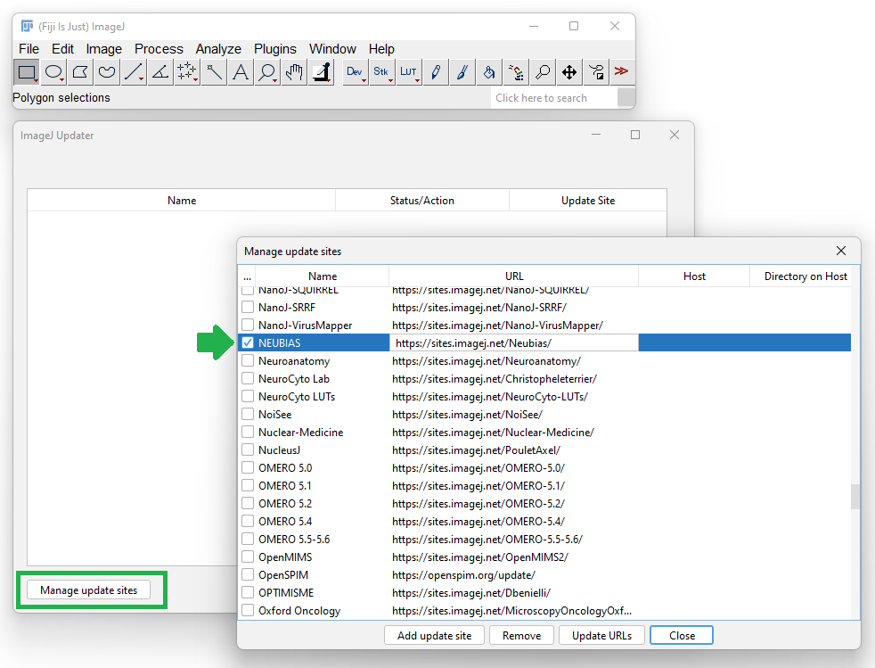
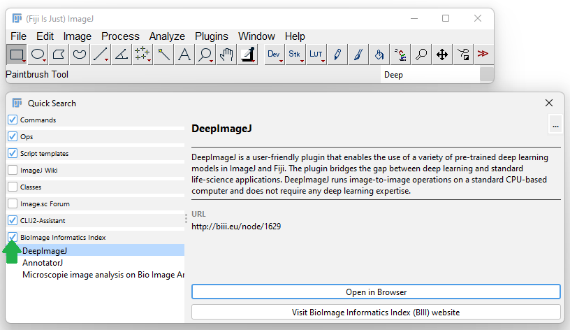

# BioImage Informatics Index search plugin for Fiji

## Installation

Within [Fiji](https://fiji.sc/Downloads), click the menu `Help > Update` and click the button `Manage update sites`. 
Activate the update site `NEUBIAS`.

## Using BIII search

Enter a search-term within the 

## License

This work is BSD2 licensed. It is free and open source.

## Contributions

The BIII search plugin project is open to contributions and feedback. 
Just create a github issue and get in touch.
